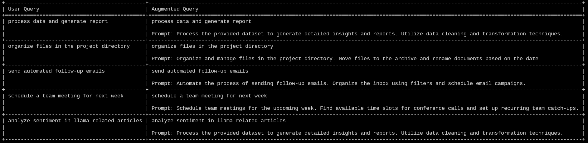

# How to Set Up Semantic Router for Your Project

Semantic Router is a library that helps you build natural language interfaces for your applications. It allows you to define semantic rules and actions for different types of user queries, such as commands, questions, or requests. In this tutorial, you will learn how to set up Semantic Router for your project in a few simple steps.

## Prerequisites

Before you start, make sure you have the following:

- A Python 3.6+ interpreter installed on your system.
- A project directory where you want to use Semantic Router.
- A text editor or IDE of your choice.

## Step 1: Create and Activate a Virtual Environment

A virtual environment is a isolated Python environment that contains the packages and dependencies you need for your project. It is recommended to use a virtual environment to avoid conflicts with other Python projects or system libraries.

To create a virtual environment, open a terminal or command prompt and navigate to your project directory. Then, run the following command:

```bash
python -m venv build_refined_rag
```

This will create a virtual environment named `build_refined_rag` in your project directory.

To activate the virtual environment, run the following command:

```bash
build_refined_rag\Scripts\activate
```

On Windows, use the above command to activate the virtual environment. On Linux or macOS, use `source build_refined_rag/bin/activate`.

You should see a `(build_refined_rag)` prefix in your terminal or command prompt, indicating that the virtual environment is active.

## Step 2: Install Semantic Router and Its Dependencies

Semantic Router requires two additional libraries: `transformers` and `torch`. `Transformers` is a library that provides state-of-the-art natural language processing models and tools. `Torch` is a library that provides tensor computation and deep learning functionality.

To install Semantic Router and its dependencies, run the following command in your terminal or command prompt:

```bash
pip install -qU semantic-router==0.0.17 transformers torch
pip install pybind11 fasttext
pip install sentence-transformers
pip install tabulate

```

This will install the latest version of Semantic Router (`0.0.17`) and the required versions of `transformers` and `torch`.

## Step 3: Start Using Semantic Router

Now, you are ready to use Semantic Router and its associated components. You can import the library in your Python script or notebook and start defining your semantic rules and actions. For example, you can create a simple semantic router that can handle greetings and farewells:

```python
import os
from semantic_router.encoders import CohereEncoder
from semantic_router import Route
from semantic_router import RouteLayer
from tabulate import tabulate

os.environ['COHERE_API_KEY'] = "sbSVmPosNgOfCJ96FQMGAoGDIiKyhLyj3bF9m0PN"

data_processing = Route(
    name="data_processing",
    utterances=[
        "process data and generate report",
        "analyze dataset for insights",
        "data cleaning and transformation",
    ],
)

file_management = Route(
    name="file_management",
    utterances=[
        "organize files in the project directory",
        "move files to archive",
        "rename documents based on date",
    ],
)

email_automation = Route(
    name="email_automation",
    utterances=[
        "send automated follow-up emails",
        "organize inbox using filters",
        "schedule email campaigns",
    ],
)

meeting_scheduling = Route(
    name="meeting_scheduling",
    utterances=[
        "schedule a team meeting for next week",
        "find available time slots for a conference call",
        "set up recurring team catch-ups",
    ],
)

task_routes = [data_processing, file_management, email_automation, meeting_scheduling]

encoder = CohereEncoder()

def print_semantic_router_info(route_layer):
    print(f"{route_layer.encoder.type=}")
    print(f"{route_layer.encoder.name=}")
    print(f"{route_layer.routes=}")

def augment_user_query(user_query, route_name):
    prompt_templates = {
        "data_processing": "Process the provided dataset to generate detailed insights and reports. Utilize data cleaning and transformation techniques.",
        "file_management": "Organize and manage files in the project directory. Move files to the archive and rename documents based on the date.",
        "email_automation": "Automate the process of sending follow-up emails. Organize the inbox using filters and schedule email campaigns.",
        "meeting_scheduling": "Schedule team meetings for the upcoming week. Find available time slots for conference calls and set up recurring team catch-ups.",
    }

    if route_name in prompt_templates:
        augmented_query = f"{user_query}\n\nPrompt: {prompt_templates[route_name]}"
        return augmented_query
    else:
        return user_query

rl = RouteLayer(encoder=encoder, routes=task_routes)

print_semantic_router_info(rl)

queries = [
    "process data and generate report",
    "organize files in the project directory",
    "send automated follow-up emails",
    "schedule a team meeting for next week",
    "analyze sentiment in llama-related articles",
]

table_data = []

for query in queries:
    route_name = rl(query).name
    augmented_query = augment_user_query(query, route_name)
    table_data.append([query, augmented_query])

headers = ["User Query", "Augmented Query"]
print(tabulate(table_data, headers, tablefmt="grid"))

```
 Result

 


